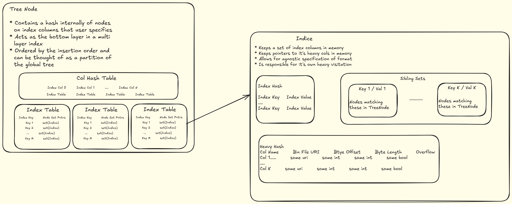

# Overview

## Diagram

## Theory

This design represents a multi-level tree index. The bottom layer consists of two distinct objects: **TreeNode** and **Indice**. Separating these concerns allows us to manage the hierarchical structure independently of the actual data storage.

### TreeNode

Each TreeNode maintains a **local hash** at its leaves for user-provided keys. Each key maps to a set of pointers referencing indices within that local hash. This partitioning avoids a global hash table, reducing memory usage and enabling scalable data organization.

TreeNodes include standard tree navigation pointers (parent, children, next, previous). When a local hash becomes too large, it splits into `k` new local hashes, distributing its data to maintain balance.  

TreeNodes serve as a layer of the index by caching key metadata. While they do not store all data, they narrow the search space to aggregating across nodes rather than scanning all indices.

### Indice

An Indice is the **atomic unit of data storage**. It stores the actual index data and provides methods to access larger data structures (e.g., blob storage).  

Each Indice maintains **siblings**, which are other indices under the same parent TreeNode and sharing the same key value. For `k` keys, an Indice can have `k` sibling sets, enabling efficient traversal to related indices.

The Indice interacts with a **Visitor** object that handles connections to the backing data. This separation allows the Indice to define *what* to do with data, while the Visitor defines *how* to access it. Users can implement custom serialization/deserialization by extending abstract methods in the Indice interface.
